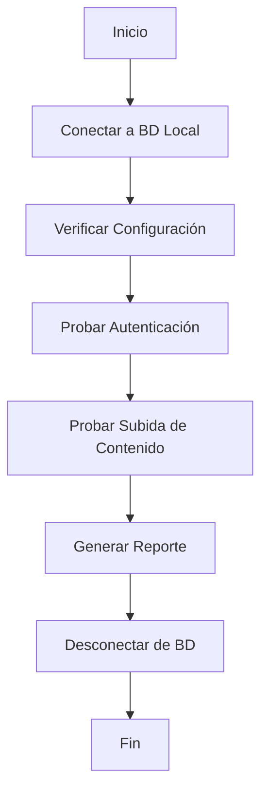

# 🧪 Sistema de Testing Escalable - TAKOPI

## 📋 Descripción

Sistema de testing robusto y escalable para verificar todas las funcionalidades críticas de TAKOPI. Diseñado para ser mantenible, extensible y fácil de usar.

## 🚀 Uso

### Testing Completo del Sistema
```bash
# Ejecutar todos los tests
npm run test:system

# Ejecutar con información detallada
npm run test:system:verbose
```

### Testing Manual
```bash
# Ejecutar directamente
node scripts/test-system.js
node scripts/test-system.js --verbose
```

## 🔧 Componentes Probados

### 1. **Autenticación** ✅
- Login via API
- Generación de tokens JWT
- Verificación de credenciales
- Manejo de sesiones

### 2. **Subida de Contenido** ✅
- Creación de publicaciones
- Validación de datos
- Procesamiento de archivos
- Asociación con usuarios

### 3. **Configuración de Base de Datos** ✅
- Sistema de flags `DB_MODE`
- Variables de entorno
- Conexión a MongoDB local/Atlas
- Configuración JWT

## 📊 Reportes

El sistema genera reportes detallados que incluyen:

- ✅ **Estado de cada test** (PASÓ/FALLÓ)
- 📈 **Porcentaje de éxito** general
- 🔍 **Detalles de errores** (si los hay)
- 🎯 **Recomendaciones** de acción

### Ejemplo de Reporte Exitoso:
```
📊 REPORTE DE TESTING DEL SISTEMA
=====================================
✅ PASÓ Autenticación
✅ PASÓ Subida de Contenido
✅ PASÓ Configuración de BD

📈 RESUMEN:
   Tests pasados: 3/3
   Porcentaje de éxito: 100%

🎉 ¡SISTEMA COMPLETAMENTE OPERATIVO!
```

## 🔄 Flujo de Testing



## 🛠️ Arquitectura Escalable

### Clase `SystemTester`
- **Logger**: Sistema de logging configurable
- **Test Results**: Almacenamiento de resultados
- **Configuración**: Variables centralizadas
- **Métodos modulares**: Cada test es independiente

### Extensibilidad
```javascript
// Agregar nuevo test
async testNewFeature() {
  this.logger.info('Probando nueva funcionalidad...');
  
  try {
    // Lógica del test
    this.testResults.newFeature = { passed: true };
    return true;
  } catch (error) {
    this.testResults.newFeature = { passed: false, error: error.message };
    return false;
  }
}
```

## 🔧 Configuración

### Variables de Entorno Requeridas
```env
# .env.local
DB_MODE=local
JWT_SECRET=tu-secret-jwt
MONGODB_URI=mongodb://localhost:27017/takopi_dev
```

### Usuario de Prueba
```javascript
TEST_USER: {
  email: 'sushipan@takopi.cl',
  password: 'test12345'
}
```

## 📈 Métricas y Monitoreo

### Métricas Capturadas
- ⏱️ **Tiempo de respuesta** de APIs
- 🔐 **Estado de autenticación**
- 📤 **Éxito de subida** de contenido
- 🗄️ **Estado de conexión** a BD

### Logs Estructurados
```javascript
this.logger.success('Operación exitosa', {
  userId: '123',
  timestamp: new Date(),
  duration: '150ms'
});
```

## 🚨 Troubleshooting

### Error: "fetch is not a function"
- **Causa**: Node.js no tiene fetch nativo
- **Solución**: El script usa `node-fetch` importado dinámicamente

### Error: "No se pudo conectar a MongoDB"
- **Causa**: MongoDB local no está corriendo
- **Solución**: Ejecutar `npm run dev:local` o iniciar MongoDB

### Error: "Token inválido"
- **Causa**: JWT_SECRET no coincide
- **Solución**: Verificar variables de entorno

## 🔮 Futuras Mejoras

### Tests Adicionales
- [ ] Testing de UI/UX
- [ ] Testing de rendimiento
- [ ] Testing de seguridad
- [ ] Testing de integración

### Características
- [ ] Tests paralelos
- [ ] Reportes HTML
- [ ] Integración CI/CD
- [ ] Notificaciones automáticas

## 📚 Referencias

- [Next.js Testing](https://nextjs.org/docs/testing)
- [MongoDB Testing](https://docs.mongodb.com/drivers/node/current/fundamentals/testing/)
- [JWT Testing](https://jwt.io/introduction)

---

**Desarrollado con ❤️ para TAKOPI - Sistema escalable y mantenible**
